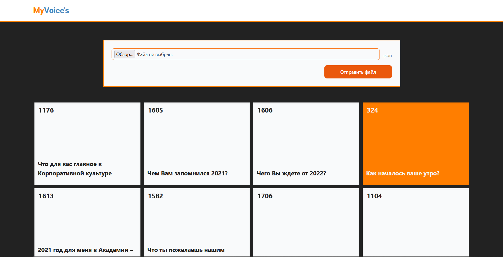
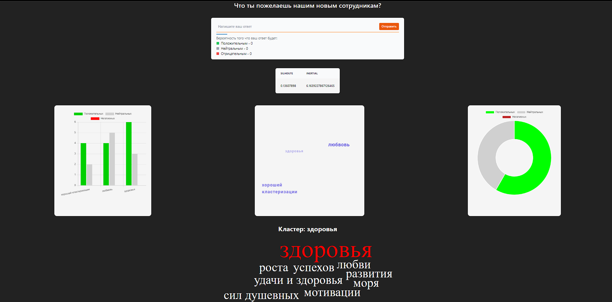

# MyVoice

  ### *Доброго времени суток!* **Вашему вниманию** представляется сервис по обработке и визуализации данных онлайн-опросов под шифром "**MyVoice**", предназначенный для решения проблемы кластеризации ответов пользователей и получение бизнес инфографики. ###

# Требования к эксплуатации
**Для запуска приложения представлены следующие требования:**
1) *PostgreSQL => 14.0*;
2) *Python => 3.11.1*;
3) *Библиотеки из requirements.txt (для работы модулей анализа и fastAPI)*;
4) *Широкополосное стабильное подключение к ИТКС "Интернет"*;
5) *Docker* 

# Способы запуска проекта
## С помощью контейнера
  Сервис имеет высокую адаптируемость, что позволяет его запустить в виде Docker-контейнера.
#### Подключение к БД
  Создайте файл *.env* в корне проекта, напишите в нем данные для подключения к БД PostgreSQL

`PORT = port `

`USER = user `

`PASSWORD = password `

`HOST = localhost \ ip `

`NAME = name`

#### Запуск Docker-контейнера
  Перейдите в директорию `backend` и выполните команду:
  
  `docker compose up --build`, ожидайте выполнения команды и переходите по выведенной ссылке.
## Запуск приложения вручную
  В случае возникновения неполадок при сборке docker-контейнера обращайтесь к любому члену команды, однако есть возможность запустить проект вручную.
  #### Подключение к БД
  Создайте файл *.env* в корне проекта, напишите в нем данные для подключения к БД PostgreSQL

`PORT = port `

`USER = user `

`PASSWORD = password `

`HOST = localhost \ ip `

`NAME = name`

#### Виртуальное окружение

Откройте терминал в корне проекта, выполните команды:
```python
python -m venv venv

\venv\Scripts\activate

cd backend

pip install -r requirements.txt
```
#### FastAPI

В папке **backend**, выполнить:

`python main.py`

После того как вы запустите свою БД, выполнив команду выше будут подняты инстансы fastApi и PostgreSQL. Далее необходимо запустить клиентскую часть приложения


#### Frontend

Откройте терминал в папке `frontend`, выполните команды:

`npm install`

`npm run serve`

После этого frontend-часть этого проекта будет доступна на *http://localhost:8080/*.

## Принцип работы проекта
Наше решение представляет собой веб-приложение с открытым API, предназначенное для формирвания семантических кластеров  пользовательских ответов и предоставление администратору опроса визуализированной статистики о сформированных данных в каждом кластере. Пользователю предоставляется возможность работать как с логами опроса, так и наблюдать в режиме реального времени информацию о получаеммых кластерах и выводить на экран статистику о частоте встречаемых слов, тональности и метриках получаемых кластеров.
#### Стэк технологий:

FastAPI, VueJS, PostgreSQL, Docker (docker-compose), transformers, torch, spacy, nltk, scikit-learn.

### Технические особенности:
В ходе работы при анализе исходныхх данны было выявлено то, что подготовка новой NLP-модели явлеяется не эффективным, 
т.к. отсутсвует семантическая связанность между вопросами и ответами, поэтому было решено использовать предобученную модель Bert Multilingual для получения embendings слов. После проведения предварительно обработки текста (стемминг,лемматизация, токенизация, удаление нецензурной лексики и стоп-слов), происходит вычисление векторов слов "налету" при отправке пользователями своих вариантов ответов на созданный опрос. Полученный вектора слов поступают на вход алгоритма кластеризации, который исходя из расстояния между векторами вычисляет в какой кластер поместить ответ. Для рассчета количества кластеров был запрограммирован алгоритм WCSS с подобранными коэфицентами, который исходя из количества данных рассчитывает оптимальный показатель количетсва кластеров. По полученным кластерам строится инфографика,связанная с частотой встречаемых слов и тем, показатели метрик всех кластеров в совокупности и поотдельности.  

### Уникальность:

1. Использование алгоритма WCSS для поиска оптимального количетсва кластеров исходя из объемов данных.
2. Реализация killer-features: ипользование Т9 для автозаполения, удаление нецензурной лексики, анализ тональности текста,построение интерактивных графиков статистики по кластерам и вывод соответсвующих метрик.
3. Работа веб-приложения может осущствлять в двух режимах:режим пользователь опроса или администратор приложения
Первый режим позволяет пользователю вводить свои варианты ответа и получать информацию о результатах опроса.
Второй режим позволяет работать администратору сайта с логами или копией комнаты опроса и также отображать всю заявленную выше инфографику и статистику о полученных кластерах.


### Скринщоты веб-страниц
#### ❗❗❗ Что-бы проверить работу сервиса необходимо использовать заранне подготовленный file.json( пример файла 1582.json, который был выложен кейсодержателем в папке all) ❗❗❗ Структура файла:
'''json
"id": 324,
    "question": "Как началось ваше утро?",
    "answers": [
        {
            "answer": "утро началось отлично",
            "count": 1
        }, ...
        '''

#### *Рисунок 1. Данная страница предначена для обработки Json файла. Информачия из Json файла записывается в БД, проходя инстанцию модулей обработки и анализа текста, и результат отображается в нижней части страницы. Для проверки можно загрузить предоставленные данные. После отработки алгоритмов оработки данных на стороницу клиента будут отображены ячейки с вопросами, нажав на которые можно будет увидеть подробый анализ ответов (см. Рисунок 2)*


#### *Рисунок 2. Страница списков вакансий с возможностью детального обзора каждой карточки. В карточке указываются все данные, которые были записаны в БД, и как можно заметить, в полях "Условия", "Требования" и "Примечания" имеется разделения на 2 колонки по подходам к обработки исходного текста для демонстрации.*
### Screencast
Если вам интересно посмотреть демонстрацию работы сервиса - предлагаю ознакомиться с записью ниже,

*https://disk.yandex.ru/d/GCF-M9KGPJBdmQ*
